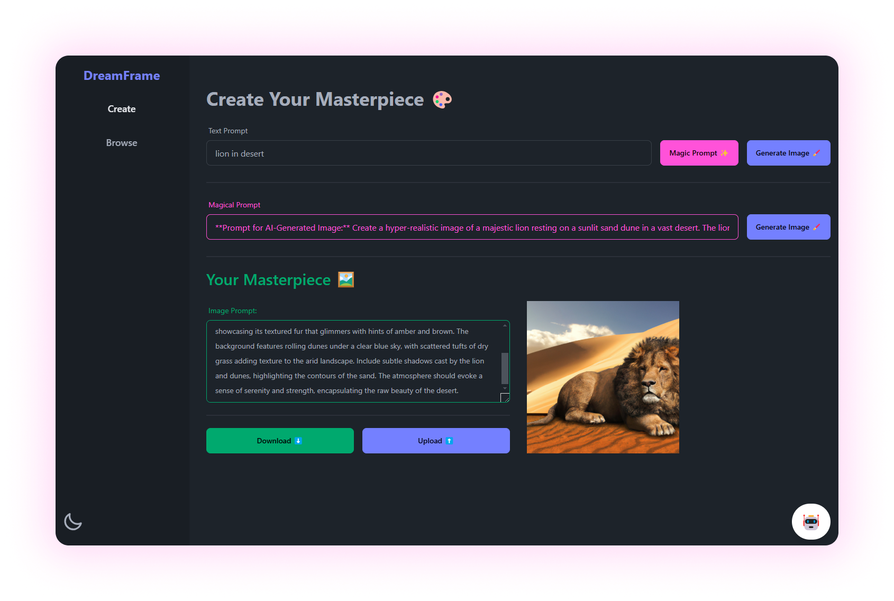
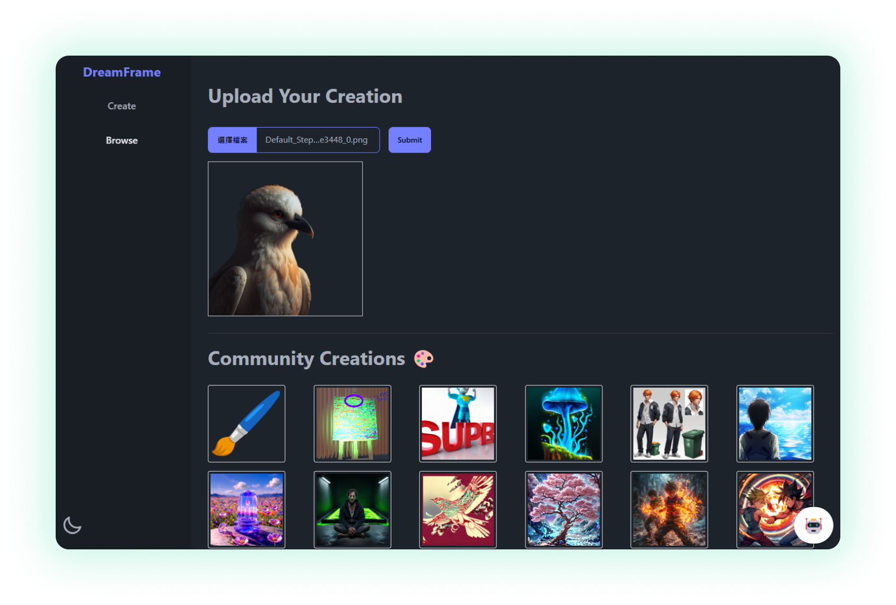

# 🖌️ DreamFrame

AI-Powered Prompt and Image Generator

An interactive web application that enables users to create stunning AI-generated images using simple or enhanced prompts. The platform also supports uploading images to a community gallery and browsing shared works.

---

## Features

### 🎨 **Dynamic Prompt-to-Image Generation**

- Generate images based on user-defined text prompts.
- Enhance creativity with an AI-generated _Magic Prompt_ feature.

### 🌟 **Community Gallery**

- Browse images created and shared by the community.
- Upload your masterpieces for others to see.

### 📂 **Image Management**

- Download generated images locally.
- Effortlessly upload images to a shared gallery.

---

## Technology Stack

- **Frontend**: React, TypeScript, Daisy UI, TailwindCSS
- **Backend**: AWS Lambda Functions(Python, Node.js), API Gateway, S3
- **AI Services**: Integration with DALL·E and GPT for text and image generation

---

## How to Use

1. **Input a Prompt**: Type a description in the _Text Prompt_ field and generate an image directly or enhance it with the _Magic Prompt_ feature.
2. **Generate an Image**: Click on "Generate Image" to visualize your prompt.
3. **Download or Upload**: Save the image locally or share it with the community.
4. **Browse the Gallery**: Explore and enjoy creative works from others.

---

## Documentation

For more detailed instructions, visit our [documentation](./docs/documentation.md).

---

## Preview

---

## Author

- Kok Siu Chung (SID:20896338)
- Hsu Siu Kit (SID: 20960426)

---

## Acknowledgments

This project is inspired by the innovative capabilities of AI in enhancing user creativity and providing a collaborative platform for sharing generated content.
